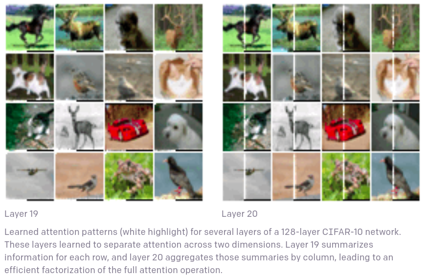
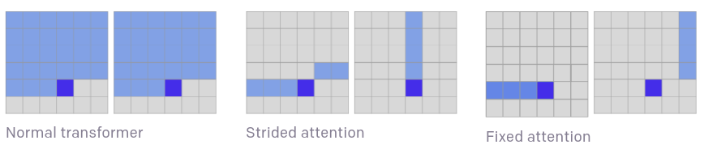

# Sparse Transformer

Fuente: https://openai.com/blog/sparse-transformer/

Otros links:

- "Generating Long Sequence with Sparse Transformer" https://arxiv.org/pdf/1904.10509.pdf
- https://openai.com/blog/block-sparse-gpu-kernels/
- https://github.com/openai/sparse_attention

OpenAI desarrolla esta variante de Transformer con el objetivo de optimizar los tiempos de cómputo, y mejorar el alcance de las dependencias entre las features ("long-range interdependencies")
$$
O(N²) \rightarrow O(N\sqrt{N})
$$
La arquitectura ha demostrado mejorar el rendimiento a la hora de predecir lo que viene tanto en texto, imágenes, y sonido.

## Deep Attention

En el Transformer tradicional, todo elemento del output está conectado a todos los elementos del input, en lo que se denomina "mecanismo de atención". Esto le da mucha flexibilidad al modelo pero requiere crear una matriz de atención de tamaño *N x N* para cada capa y cabeza de atención.

Una manera de reducir esta carga es usar checkpoints en el backpropagation. Esta opción logra hacer que el máximo de memoria a utilizar no dependa de la cantidad de capaz de la red, lo que permite entrenar redes más profundas.

## Sparse attention

Incluso calculando una sola matriz de atención, es impractico aplicar lo anterior a inputs muy grandes. Aquí entran los *sparse attention patterns*, donde cada posición del output se calcula en base a un subconjunto de entradas del input. Por ejemplo, raíz de N en vez de N. Es así como la complejidad del cálculo baja.

¿Cuándo usar sparse attention? Cuando las partes del output dependen principalmente de pocos elementos del input. Una manera de visualizar esto es con el entrenamiento de CIFAR-10:

En esta visualización se resaltaron en blanco los pixeles que usaba el modelo para obtener el siguiente pixel. Se puede ver que la capa 19 aprendió a enfocarse solo en la fila, mientras que la 20 solo se fija en la columna. Un detalle importante a señalar es que la *sparsification* se aplica solamente a las capaz que cumplen con esta característica.

Hay veces en que la atención se centra en un subconjunto pequeño del input, pero este patrón no es uniforme, sino más bien varía a través de todos los pixeles de la imagen. Para poder aprender estos patrones, el modelo implementa una factorización bidimiensional de la matriz de atención. De esta forma se puede acceder a cualquier entrada de la matriz completa de atención mediante 2 pasos de atención sparse.

La primera versión de esta factorización es la *strided attention*, que se enfoca en la fila o columna relativa al pixel a predecir.

La segunda versión es la *fixed attention*, que se enfoca en pixeles en una columna fija y en los elementos después del último elemento de la columna. Este patrón es útil cuando el input no obedece una estructura bidimensional. Por ejemplo, texto o música en sequencia.

## Generating raw audio waveforms

Es posible adaptar el algoritmo para que procese audio en vez de imagenes cambiando el embedding posicional.